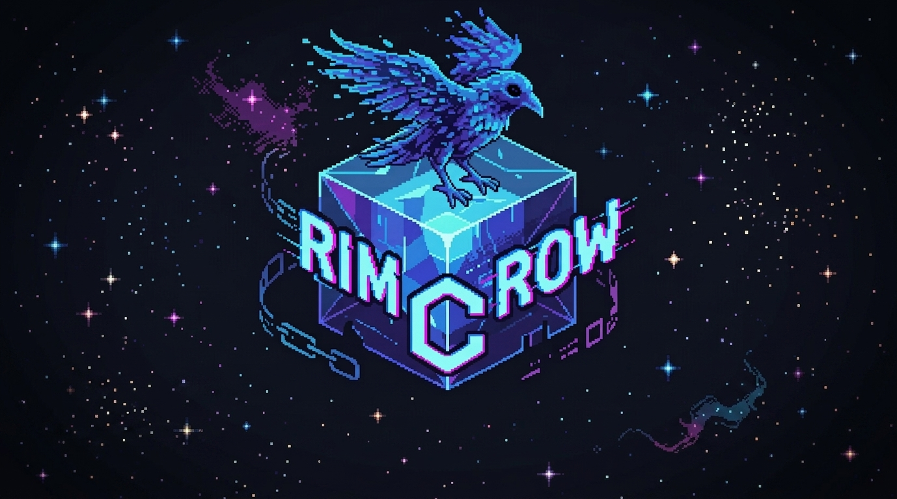
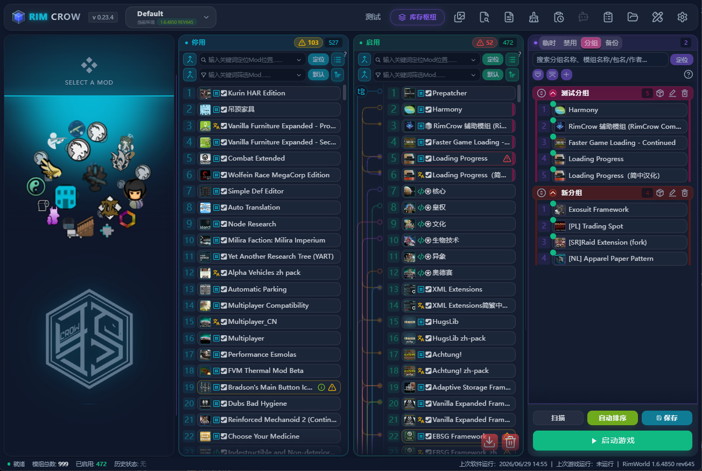

# RimCrow

> **Translation notice:** This English documentation was generated with AI assistance from the Chinese source docs. Some descriptions may be inaccurate or not fully aligned with the current UI. Corrections and improvement suggestions are welcome.

[中文](./README.md)



RimCrow, formerly RimModManager, is a desktop mod manager for **RimWorld**. It brings mod scanning, load order management, backups, Workshop tools, Git-based mod sources, log troubleshooting, texture optimization, and AI-assisted diagnosis into one app.



## Documentation

Chinese docs are the primary source of truth. English docs are maintained as paired user-facing guides for the main workflows.

- First run: see [Quick Start](./doc/en/quick-start.md).
- Paths and launch: see [Profiles and Paths](./doc/en/environment-and-paths.md).
- Mod lists and load order: see [Mod List and Load Order](./doc/en/mod-list-and-load-order.md).
- Auto sort and rules: see [Auto Sort and Rules](./doc/en/auto-sort-and-rules.md).
- Workshop and download sources: see [Workshop and Download Sources](./doc/en/workshop-and-download-sources.md).
- Backup, import, and export: see [Backup, Import, and Export](./doc/en/backup-import-export.md).
- Logs and AI diagnosis: see [Logs and AI Diagnosis](./doc/en/logs-and-ai-diagnosis.md).
- Texture optimization: see [Texture Optimization](./doc/en/texture-optimization.md).

## Platform Status

| Platform | Status | Notes |
| --- | --- | --- |
| Windows | Primary platform | Desktop mode, packaging, and full workflows are mainly verified on Windows. WebView2 Runtime is required. |
| macOS | Basic path support | Basic path detection for RimWorld, Steam, user data, Player.log, and Steam launch paths is available. Packaging quality is not promised yet. |
| Linux | In progress | Some Steam path detection has been added, but desktop runtime, Steamworks, and packaging are not guaranteed yet. |

## Main Features

- Scan RimWorld mods from local folders, Workshop folders, and the manager library.
- Enable, disable, group, tag, color, annotate, and batch-edit mods.
- Manage load order with drag-and-drop, auto sort, rules, dependencies, interlocked mods, and issue hints.
- Maintain multiple RimWorld profiles with separate paths, user data, backups, rules, and launch settings.
- Back up, restore, compare, import, and export load orders.
- Search and manage Steam Workshop items, collections, SteamCMD downloads, and Steam client subscriptions.
- Track GitHub, GitLab, GitGud, zip, and other direct mod sources.
- Detect missing items, duplicate package IDs, coexisting versions, removed mods, and leftover records.
- View game logs, group common errors, search file contents, and use AI-assisted log diagnosis.
- Optimize textures with DDS generation, scaling options, fallback handling, and cleanup tools.
- Export mod recommendation lists in several formats.
- Use the multi-language UI and external translation workflow.

## Download

If you only want to use RimCrow, download a release build instead of running from source.

- Lanzou Cloud: https://wwbns.lanzouu.com/b00mq4tqgf
  Password: `aite`
- GitHub Releases: https://github.com/Inky-Feather/RimCrow/releases

## Quick Start

1. Download a full release package.
2. Extract it to a stable folder.
3. Start RimCrow and confirm the RimWorld game folder, user data folder, Workshop folder, and manager library folder.
4. Scan mods.
5. Enable the mods you want.
6. Run auto sort.
7. Check red errors and yellow warnings.
8. Save the load order, then launch the game.

## Common Troubleshooting

- Blank window or frontend timeout: install or repair Microsoft Edge WebView2 Runtime. Browser mode can help isolate desktop shell issues.
- Wrong game or data path: reselect the RimWorld game folder, user data folder, and Workshop folder, then scan again.
- SteamCMD download failure: check SteamCMD setup, proxy settings, network access, disk space, and whether the Workshop item is still available.
- AI request failure: check protocol, Base URL, API key, model name, proxy, quota, and provider status.
- Update failure: download the full package from another release channel and overwrite the old installation.

## Development

Use release builds for normal play. Source builds are mainly for development.

Recommended branch:

- `main`: release-oriented snapshots.
- `dev`: latest active development.

Basic setup:

```powershell
git clone --recurse-submodules https://github.com/Inky-Feather/RimCrow
cd RimCrow
git switch dev
uv sync
cd frontend
npm install
```

Run in development mode:

```powershell
cd frontend
npm run dev
cd ..
uv run python main.py
```

Run tests:

```powershell
uv run pytest -q tests
```

## Translation

The UI currently includes:

- Simplified Chinese: `zh-CN`
- Traditional Chinese: `zh-TW`
- English: `en`
- German: `de`
- Korean: `ko`
- Russian: `ru`

Chinese source text in code is the default reference for built-in locales. After changing source UI text, run the locale sync scripts described in the Chinese README.

## Privacy And Safety

RimCrow mainly works with local RimWorld files, mod folders, configuration, logs, and its own database.

Sensitive fields such as AI API keys, Steam Web API keys, and proxy credentials are stored through the system credential store when possible. Logs and API parameters are masked where supported, but you should still review logs, configs, and exported packages before sharing them.

Features that use AI providers, Steam, GitHub, Lanzou Cloud, community rules, or external databases may send requests to those third-party services. Local list management, sorting, and backup workflows can still be used without network-dependent features.

## License

MIT
