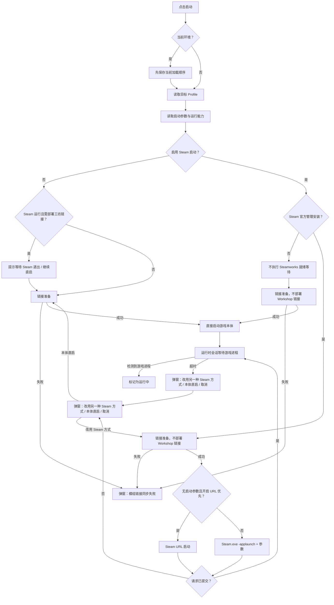

启动流程

```mermaid
flowchart TD
  A["点击启动"] --> B{"当前环境？"}
  B -->|是| C["先保存当前加载顺序"]
  B -->|否| D["读取目标 Profile"]
  C --> D
  D --> E["读取启动参数与运行能力"]

  E --> F{"启用 Steam 启动？"}
  F -->|否| G{"Steam 运行且需部署工坊链接？"}
  G -->|是| H["提示等待 Steam 退出 / 继续直启"]
  H --> I["链接准备"]
  G -->|否| I
  I -->|失败| X["弹窗：模组链接同步失败"]
  I -->|成功| J["直接启动游戏本体"]

  F -->|是| K{"Steam 官方管理安装？"}
  K -->|否| L["不执行 Steamworks 就绪等待"]
  L --> M["链接准备，不部署 Workshop 链接"]
  M -->|失败| X
  M -->|成功| J

  K -->|是| N["链接准备，不部署 Workshop 链接"]
  N -->|失败| X
  N -->|成功| O{"无启动参数且开启 URL 优先？"}
  O -->|是| P["Steam URL 启动"]
  O -->|否| Q["Steam.exe -applaunch + 参数"]

  P --> R{"请求已提交？"}
  Q --> R
  R -->|否| S["弹窗：改用另一种 Steam 方式 / 本体直启 / 取消"]
  S -->|改用 Steam 方式| N
  S -->|本体直启| I
  R -->|是| T["运行时会话等待游戏进程"]

  J --> T
  T -->|检测到游戏进程| U["标记为运行中"]
  T -->|超时| V["弹窗：改用另一种 Steam 方式 / 本体直启 / 取消"]
  V --> S
```
